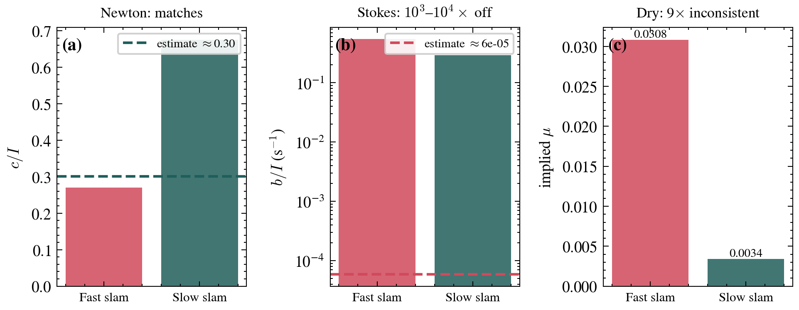

<div align="center">

# 🚪 문이 쾅 닫힐 때의 회전·마찰 동역학

**스마트폰 자이로스코프로 Klein _et al._ (Am. J. Phys. 85, 30, 2017) 재현**

<p>
<a href="https://www.python.org"></a>


<a href="https://doi.org/10.1119/1.4964134"></a>
</p>

[English](README.md) · **한국어**

<em>Team solvE (Group 14) · DGIST 일반물리</em>

</div>

---

## 개요

문이 쾅 닫히면 경첩을 중심으로 돌다가 점점 느려지면서 멈춥니다. 이 감속을 만드는 마찰이
셋 중 무엇인지가 이 프로젝트의 질문입니다. 일정한 마찰(**건마찰**), 속도에 비례하는
마찰(**스토크스**), 속도 제곱에 비례하는 공기저항(**뉴턴**) 중에서요. Klein 등의 논문을
실제 문으로 재현했습니다. 각속도 $\omega(t)$ 를 스마트폰 자이로스코프로 바로 측정해서,
원논문처럼 가속도를 각속도로 환산($\omega=\sqrt{a_r/r}$)할 필요가 없었습니다. 여섯 개
마찰 모델을 데이터에 맞춰 보고, 운동방정식을 수치적분해서 해석해가 맞는지도 확인했습니다.

논문에서 얻은 가장 큰 교훈은 **잘 맞는다고 옳은 모델은 아니라는 것**입니다. 진짜 판단은
맞춰서 나온 계수가 물리적으로 말이 되는지를 봐야 합니다.

## 핵심 결과

> 적합이 잘 되느냐($R^2$)가 아니라 계수가 물리적으로 말이 되느냐로 보면, 스토크스와
> 건마찰은 탈락하고 **뉴턴 공기저항($\omega^2$)만 남습니다.** 논문 결론과 같습니다.

| 계수 | 적합값 (빠름 / 느림) | 물리적 어림값 | 판정 |
|---|---|---|---|
| $a/I$ (건마찰) | 1.09 / 0.12 (μ ≈ 0.031 / 0.0034) | $3\mu g/w$ | ❌ μ 가 9배 차이 |
| $b/I$ (스토크스) | 0.54 / 0.29 | $\sim 6\times10^{-5}$ | ❌ $10^3$–$10^4$배 큼 |
| $c/I$ (뉴턴) | 0.27 / 0.68 | $\lesssim 0.30$ | ✅ **자릿수 일치, 채택** |

<div align="center">

</div>

- 느린 슬램에서 F-검정을 돌리면 순수 직선(건마찰) 모델은 탈락합니다 ($F_{D\to DN}\approx4\times10^{3}$, $p<0.001$).
- 해석해와 `solve_ivp` 수치적분이 약 $10^{-8}$ rad/s 까지 일치합니다.

## 저장소 구조

```
physics-door-slam/
├── data/                     # 원본 자이로 데이터(빠름/느림) + 세팅값
├── src/
│   ├── friction_models.py    # 6개 해석해 + solve_ivp 시뮬레이션
│   ├── analysis.py           # 구간 추출 · curve_fit · R²/SSE/AIC · 물리타당성
│   └── make_figures.py       # 저널 스타일 그림 + LaTeX 표
├── notebooks/analysis.ipynb  # 전체 흐름(GitHub 인라인 렌더)
├── figures/                  # 생성 그림(300 DPI)
└── report/                   # LaTeX 보고서(영문·한글) + 컴파일 PDF
```

## 시작하기

```bash
pip install -r requirements.txt

# 모든 그림·LaTeX 표 다시 만들기
cd src && python make_figures.py

# 또는 노트북 열기
jupyter notebook notebooks/analysis.ipynb
```

보고서는 [Tectonic](https://tectonic-typesetting.github.io/)(XeTeX)으로 빌드합니다.

```bash
cd report && tectonic report.tex      # 영문
                tectonic report_ko.tex  # 한글
```

## 방법

1. **측정.** 실제 문에 Phyphox 자이로스코프를 붙이고, 세게·약하게 두 번 닫으며 약 460 Hz 로 기록합니다.
2. **구간.** 자유롭게 도는 구간만 쓰고, 문틀에 닿기 직전 공기가 눌리는 구간은 뺍니다.
3. **적합.** `scipy.optimize.curve_fit` 으로 여섯 모델을 맞추고 $R^2$·SSE·AIC 를 봅니다.
4. **검증.** 맞춰서 나온 $a/I, b/I, c/I$ 를 손으로 어림한 물리값과 비교합니다.
5. **시뮬레이션.** `solve_ivp` 로 운동방정식을 적분해 해석해와 맞는지 확인합니다.

## 팀

| 팀원 | 역할 |
|---|---|
| 채은우 | 데이터 분석 · GitHub · 보고서(LaTeX) |
| 강성민 | 보고서(LaTeX) · 시뮬레이션 |
| 장민석 | 실험 · 데이터 수집 |
| 주솔비 | 발표 · 영상 |

## 참고문헌

P. Klein, A. Müller, S. Gröber, A. Molz, J. Kuhn,
_"Rotational and frictional dynamics of the slamming of a door,"_
**Am. J. Phys. 85, 30–37 (2017).** [doi:10.1119/1.4964134](https://doi.org/10.1119/1.4964134)
