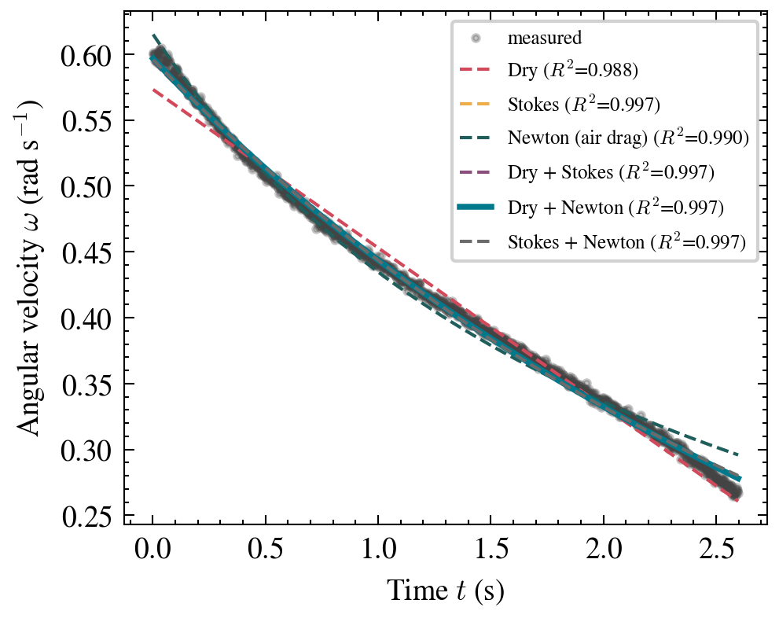
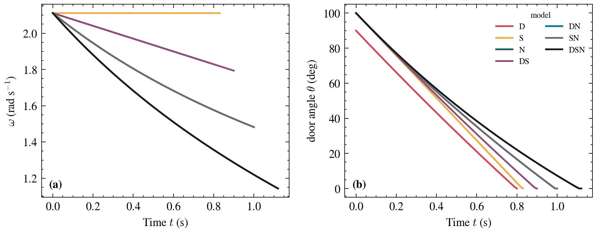

<div align="center">

# 🚪 Rotational and Frictional Dynamics of a Slamming Door

**Reproducing Klein _et al._ (Am. J. Phys. 85, 30, 2017) with a smartphone gyroscope**

<p>
<a href="https://www.python.org"></a>


<a href="https://doi.org/10.1119/1.4964134"></a>
</p>

**English** · [한국어](README.ko.md)

<em>Team solvE (Group 14) · DGIST General Physics</em>

</div>

---

## Overview

When a door is slammed it rotates about its hinges, decelerates, and stops. Klein _et al._
asked which of three friction laws governs that motion: the constant (**dry**), the linear
(**Stokes**), or the quadratic (**Newtonian air drag**) one. 

We reproduce their study on a real door with high-precision measurements. Unlike the original work, we measured the angular velocity $\omega(t)$ **directly with a smartphone gyroscope**, eliminating the error-prone conversion from radial acceleration. Furthermore, we conducted comprehensive numerical simulations for all six friction models to validate our analytical derivations.

## Key Features

*   **Direct Measurement:** High-frequency (460 Hz) gyroscope data via Phyphox.
*   **Rigorous Setup:** Physical parameters ($m, w, h$) were obtained by **detaching the door** for direct measurement.
*   **Comprehensive Modeling:** Analysis of 6 distinct friction models (D, S, N, DS, DN, SN).
*   **Numerical Validation:** Comparison between analytical solutions and `solve_ivp` integration (max diff $\sim 10^{-8}$ rad/s).
*   **Comparative Simulation:** Long-term behavior analysis of all models to visualize asymptotic decay.

## Key Result

> Judged by the **physical plausibility** of the fitted coefficients (not just $R^2$),
> Stokes and dry friction are rejected, and **Newtonian $\omega^2$ air drag is the only
> consistent mechanism**. This confirms the findings of Klein et al.

| Coefficient | Fitted (fast / slow) | Physical estimate | Verdict |
|---|---|---|---|
| $a/I$ (Dry) | 1.09 / 0.12 → μ = 0.031 / 0.0034 | $3\mu g/w$ | ❌ μ inconsistent by 9× |
| $b/I$ (Stokes) | 0.54 / 0.29 | $\sim 6\times10^{-5}$ | ❌ $10^3$–$10^4$× too large |
| $c/I$ (Newton) | 0.27 / 0.68 | $\lesssim 0.30$ | ✅ **Accepted (same order)** |

<div align="center">
 
</div>

## Repository Structure

```
physics-door-slam/
├── data/
│   ├── simulation/           # Raw CSV data for all 7 simulation models
│   ├── fast_slam.csv         # Measured gyroscope data (hard slam)
│   └── slow_slam.csv         # Measured gyroscope data (gentle slam)
├── src/
│   ├── analysis.py           # Curve fitting, statistical analysis (AIC, R²)
│   ├── friction_models.py    # Analytical solutions
│   ├── simulation.py         # Numerical integration and animation logic
│   └── make_figures.py       # Generation of journal-style plots
├── report/                   # LaTeX source and compiled PDF report
├── figures/                  # High-resolution plots and setup photos
└── notebooks/                # Interactive analysis walkthrough
```

## Getting Started

1.  **Install dependencies:**
    ```bash
    pip install -r requirements.txt
    ```
2.  **Generate results:**
    ```bash
    cd src && python make_figures.py
    ```
3.  **Build the report:**
    We recommend using [Tectonic](https://tectonic-typesetting.github.io/) to handle LaTeX dependencies automatically:
    ```bash
    cd report && tectonic report.tex
    ```

## Team solvE (Group 14)

*   **Eunwoo Chae:** Data analysis · GitHub · Report (LaTeX)
*   **Kangmin Seong:** Report (LaTeX) · Simulation
*   **Minseok Jang:** Experiment · Data acquisition
*   **Solbi Joo:** Presentation · Video

## Reference

P. Klein, A. Müller, S. Gröber, A. Molz, J. Kuhn,
_"Rotational and frictional dynamics of the slamming of a door,"_
**Am. J. Phys. 85, 30–37 (2017).** [doi:10.1119/1.4964134](https://doi.org/10.1119/1.4964134)
